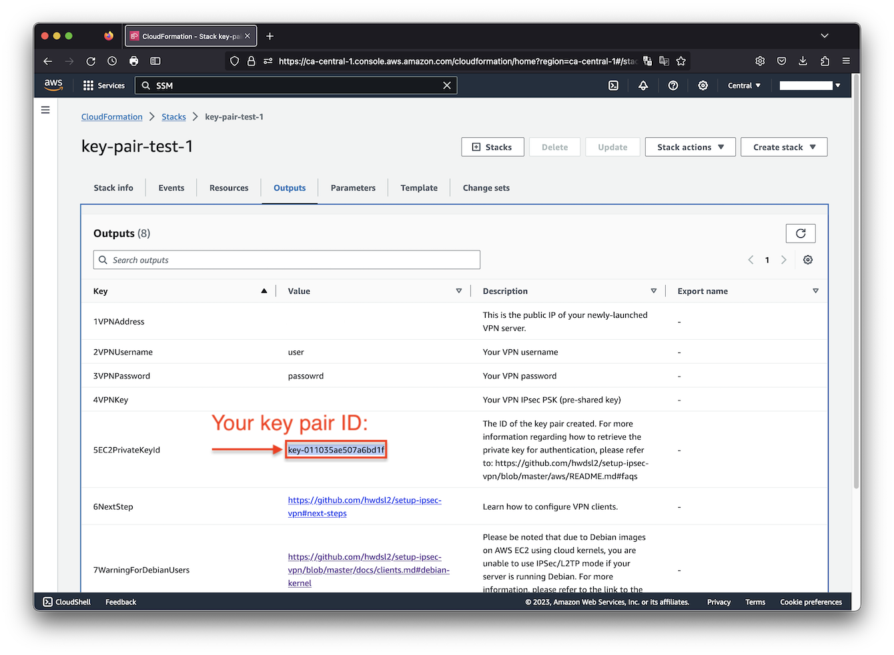

[English](README.md) | [中文](README-zh.md)
[](https://www.clever-vpn.net)

# Deploy to Amazon EC2 using CloudFormation

This template will create a fully-working IPsec VPN server on Amazon Elastic Compute Cloud (Amazon EC2). Please make sure to check the EC2 [pricing details](https://aws.amazon.com/ec2/pricing/on-demand/) before continuing. Using a `t2.micro` or `t3.micro` server instance for your deployment may qualify for the [AWS Free Tier](https://aws.amazon.com/free/).

Available customization parameters:

- Amazon EC2 instance type
> <details><summary><strong>Note</strong>: It is possible that not all instance type options offered by this template are available in a specific AWS region.(expand for details)
> </summary>
> 
> For example, you may not be able to deploy an `m5a.large` instance in `ap-east-1` (hypothetically). In that case, you might experience the following error during deployment: `The requested configuration is currently not supported. Please check the documentation for supported configurations`. Newly released regions are more prone to having this problem as there are less variety of instances. For more info about instance type availability, refer to [https://instances.vantage.sh/](https://instances.vantage.sh/).</details>

- OS for your VPN server (Ubuntu **24.04**/22.04, Debian 12/11, Amazon Linux 2)
- Your VPN username
- Your VPN password
- Your VPN IPsec PSK (pre-shared key)

> **Note:** A secure IPsec PSK should consist of at least 20 random characters. DO NOT use these special characters within values: `\ " '`

Make sure to deploy this template with an **AWS Account Root User** or an **IAM Account** with **Administrator Access**.

Right-click this [**template link**](https://raw.githubusercontent.com/hwdsl2/setup-ipsec-vpn/master/aws/cloudformation-template-ipsec.json) and save as a file on your computer. Then upload it as the template source in the [stack creation wizard](https://console.aws.amazon.com/cloudformation/home#/stacks/new). You may choose an AWS region using the selector to the right of your account information on the navigation bar. Continue creating the stack, and in the final step make sure to confirm that this template may create IAM resources.

After you click "create stack" in the final step, please wait for the stack creation and VPN setup to complete, which may take up to 15 minutes. As soon as the stack's status changes to **"CREATE_COMPLETE"**, you are ready to connect to the VPN server. Click the **Outputs** tab to view your VPN login details. Then continue to [Next steps: Configure VPN Clients](../README.md#next-steps).

Click the icon below to start:

[](https://console.aws.amazon.com/cloudformation/home#/stacks/new)

## Screenshots

<details>
<summary>
Click here to view screenshots.
</summary>


</details>

## FAQs

<details>
<summary>
How to retrieve the IKEv2 credentials following the deployment?
</summary>

After the deployment completes, connection credentials generated for IKEv2 mode are uploaded to a newly created AWS Simple Storage Service (S3) bucket. The download link is then provided under the **Outputs** tab.

Simply click on the link to download an archive named `profiles.zip`. To extract the contents from the archive, you will be prompted to enter a password, which is the **VPN password you specified when creating the stack**.

It's important to note that the link provided for downloading the IKEv2 credentials **will expire in 1 day** following the successful deployment of the stack. If you delete the stack, the bucket that stores the IKEv2 crendentials will not be automatically deleted.

To learn more about how to configure your clients using IKEv2 mode, please refer to: [Guide: How to Set Up and Use IKEv2 VPN](../docs/ikev2-howto.md).


</details>

<details>
<summary>
How to connect to the server via SSH after deployment?
</summary>

**Option 1:** Connect using [EC2 Instance Connect](https://docs.aws.amazon.com/AWSEC2/latest/UserGuide/ec2-instance-connect-methods.html).

**Option 2:** Connect to the server using SSH. See details below.

You need to know the username and the private key for your Amazon EC2 instance in order to login to it via SSH.

Each Linux server distribution on EC2 has its own default login username. Password login is disabled by default for new instances, and the use of private keys, or "key pairs", is enforced.

List of default usernames:
> **Reference:** [https://docs.aws.amazon.com/AWSEC2/latest/UserGuide/connection-prereqs.html](https://docs.aws.amazon.com/AWSEC2/latest/UserGuide/connection-prereqs.html)

| Distribution | Default Login Username |
| --- | --- |
| Ubuntu |  `ubuntu` |
| Debian | `admin` |
| Amazon Linux 2 | `ec2-user` |

This template generates a key pair for you during deployment, and to acquire the private key you can choose one of the following two methods.

1. Copy the key pair ID displayed under the **Outputs** tab, and use the following command to retrieve the private key material and save it into a certificate file:

   > **Note:** You need to first properly set up the AWS CLI on your computer before using the following command. For more information on how to get started with AWS CLI, please refer to [Get started with the AWS CLI](https://docs.aws.amazon.com/cli/latest/userguide/cli-chap-getting-started.html).

   ```
   $ aws ssm get-parameter --region your-region --name /ec2/keypair/your-key-pair-id --with-decryption --query Parameter.Value --output text > new-key-file.pem
   ```

   

2. Copy the private key material directly from the **Outputs** tab, and save it into a certificate file. Note that You may need to format the private key by replacing all spaces with newlines, before saving to a file. The file will need to be set with [proper permissions](https://docs.aws.amazon.com/AWSEC2/latest/UserGuide/connection-prereqs.html#connection-prereqs-private-key) before using.

   

To apply proper permissions to your private key file, run the following command under the directory where the file is located:

```bash
$ sudo chmod 400 new-key-file.pem
```

Example command to login to your EC2 instance using SSH:

```bash
$ ssh -i path/to/your/new-key-file.pem instance-username@instance-ip-address
```
</details>

<details>
<summary>
How to delete the CloudFormation stack?
</summary>

You may use the "Delete" button on the CloudFormation stack page to delete the CloudFormation stack you created and its associated resources. Note that when deleting the stack, the S3 bucket that stores the generated IKEv2 credentials will not be automatically deleted. Refer to "How to retrieve the IKEv2 credentials following the deployment" above.
</details>

## Author

Copyright (C) 2020-2024 [Scott X. L.](https://github.com/scottpedia) <[ge105@ncf.ca](mailto:ge105@ncf.ca)>
